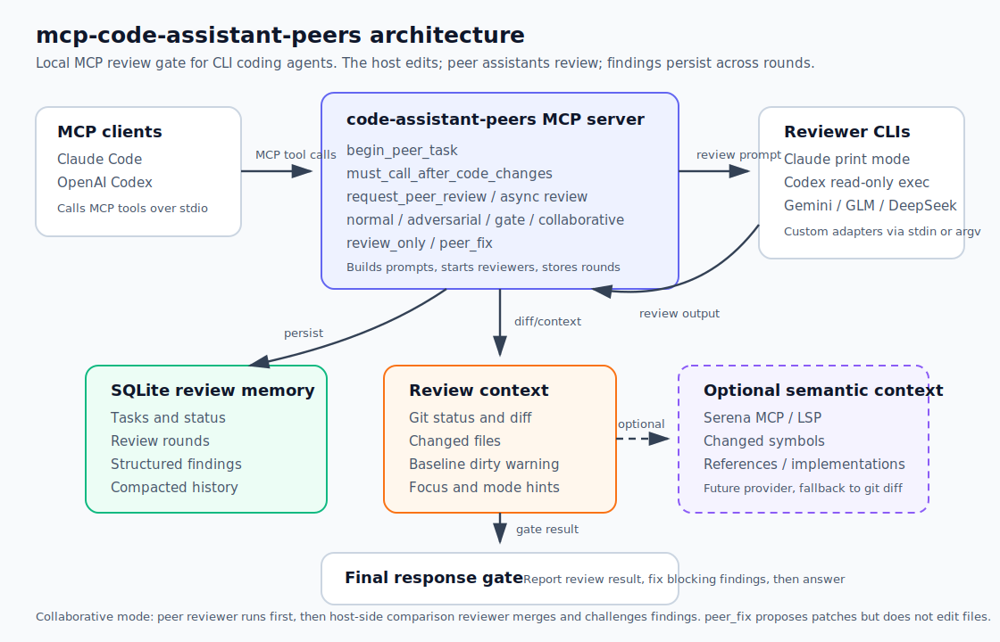

# mcp-code-assistant-peers

[English](../README.md) | [日本語](README.ja.md) | [中文](README.zh-CN.md)

CLI 기반 코딩 어시스턴트끼리 서로 코드를 검토하게 만드는 MCP 서버입니다.

호스트 어시스턴트가 코드를 수정하면, 이 서버가 설정된 peer 어시스턴트에게 diff 리뷰를 요청합니다. Claude Code와 Codex는 기본 지원하며, Gemini, GLM, DeepSeek 같은 CLI도 adapter 설정으로 추가할 수 있습니다. 리뷰 라운드, finding, task 상태는 SQLite에 로컬 저장되어 이후 라운드에서 이전 지적이 해결됐는지 확인할 수 있습니다.



## 사용 흐름


1. 호스트 어시스턴트가 코드를 수정합니다.
2. MCP gate가 peer reviewer CLI에 diff와 context를 전달합니다.
3. reviewer finding과 상태가 SQLite에 저장됩니다.
4. 호스트가 blocking finding을 수정하고 다시 gate를 통과한 뒤 최종 답변합니다.

## 주요 기능

- Claude Code/Codex 기본 adapter
- Claude 리뷰를 백그라운드 인터랙티브 Claude 세션으로 보내는 `claude-live` adapter (구독 풀 사용, `claude -p` 미사용, 자동 시작 + `claude -p` fallback)
- stdin 또는 argv prompt를 받는 커스텀 CLI adapter
- 코드 수정 후 호출해야 하는 mandatory review gate
- `normal`, `adversarial`, `gate`, `collaborative` 리뷰 모드
- reviewer가 직접 파일을 수정하지 않고 수정 제안만 하는 `peer_fix` workflow
- SQLite 기반 task memory, review rounds, findings, async status
- MCP host timeout을 피하기 위한 async-first review flow
- MCP 등록과 상태 확인을 위한 `setup`, `doctor`
- `CLAUDE.md`, `AGENTS.md` project rule 설치

## 요구사항

- Bun
- Claude Code CLI: `claude`
- OpenAI Codex CLI: `codex`
- 선택 사항: Gemini, GLM, DeepSeek 등 추가 LLM CLI
- MCP client가 stdio server를 실행할 수 있는 trusted local project

```bash
bun install
bun run check
```

## 빠른 시작

소스 checkout에서 가장 쉬운 설치 방법:

```bash
bun install
bun run setup
```

또는 shell wrapper:

```bash
sh scripts/setup.sh
```

기본값은 Claude Code와 Codex 모두에 MCP를 등록하고, `review_only`, `normal` 모드, Codex MCP timeout 600초를 설정합니다.

자주 쓰는 변형:

```bash
# Claude Code만 등록
bun cli.ts setup claude

# reviewer가 수정 제안을 포함하고 compact gate review 사용
bun cli.ts setup both --workflow=peer_fix --mode=gate

# multi-peer review 설정
bun cli.ts setup both --peers=claude,codex,gemini --mode=adversarial

# 설치된 Claude/Codex/Gemini reviewer 자동 감지
# Gemini 자동 선택은 GEMINI_API_KEY/GOOGLE_API_KEY가 있을 때만 사용합니다.
bun cli.ts setup codex --peers=auto

# 현재 프로젝트에 CLAUDE.md / AGENTS.md rule 설치
bun cli.ts setup both --install-rules

# 실제 변경 없이 등록 명령만 출력
bun cli.ts setup both --dry-run
```

설치 후 Claude Code/Codex를 재시작하고 MCP client에서 `code_assistant_peers_setup`을 호출해 런타임 상태를 확인하세요.

로컬 진단:

```bash
bun cli.ts doctor
```

`doctor`는 Bun, Claude CLI, Codex CLI, Gemini CLI, local review storage, Codex MCP timeout 설정을 확인합니다.

## 수동 등록

Claude Code:

```bash
claude mcp add --scope user --transport stdio code-assistant-peers -- env HOST_ASSISTANT=claude bun /path/to/mcp-code-assistant-peers/server.ts
```

Codex:

```bash
codex mcp add code-assistant-peers --env HOST_ASSISTANT=codex -- bun /path/to/mcp-code-assistant-peers/server.ts
```

글로벌 설치 후에는 server binary를 사용할 수 있습니다.

```bash
claude mcp add --scope user --transport stdio code-assistant-peers -- env HOST_ASSISTANT=claude code-assistant-peers-server
codex mcp add code-assistant-peers --env HOST_ASSISTANT=codex -- code-assistant-peers-server
```

## Assistant Adapters

기본 adapter:

```text
claude -> claude -p --permission-mode plan ...
codex  -> codex exec --sandbox read-only --skip-git-repo-check -
gemini -> gemini --skip-trust --approval-mode plan -p ""  # 프롬프트는 stdin으로 전달
```

네 번째 기본 adapter인 `claude-live`는 `claude -p`를 실행하지 않고 localhost broker를 통해
**백그라운드 인터랙티브 Claude 세션**으로 리뷰를 보냅니다. 그래서 Claude 리뷰가 Agent SDK
크레딧 풀이 아닌 **구독 풀**에 남습니다. broker와 reviewer worker는 첫 `claude-live` 리뷰 때
자동으로 시작되고, 세션은 repo별 read-only이며, broker/세션 장애 시 `claude -p` 실행으로
fallback합니다. peer로 `claude`를 쓰던 자리에 그대로 사용하면 됩니다
(`PEER_ASSISTANTS=claude-live` 또는 `codex,claude-live`). 자세한 설정과 과금 확인 체크리스트는
[broker/REVIEWER.md](../broker/REVIEWER.md)를 참고하세요.

다른 CLI는 `CODE_ASSISTANT_PEERS_ASSISTANTS`에 JSON으로 등록합니다. `prompt_transport`는
`stdin`, `argv`, `channel` 중 하나입니다 (`channel`은 command 실행 대신 live-reviewer broker로
리뷰를 보냅니다).

```bash
export CODE_ASSISTANT_PEERS_ASSISTANTS='{
  "glm": {
    "command": ["glm", "chat"],
    "prompt_transport": "stdin"
  },
  "deepseek": {
    "command": ["deepseek", "chat"],
    "prompt_transport": "stdin"
  }
}'
```

명시적 host/peer 설정:

```bash
HOST_ASSISTANT=gemini PEER_ASSISTANT=codex code-assistant-peers-server
HOST_ASSISTANT=codex PEER_ASSISTANT=gemini code-assistant-peers-server
```

multi-peer review:

```bash
HOST_ASSISTANT=claude PEER_ASSISTANTS=codex,gemini,glm code-assistant-peers-server
```

결과 상태:

- `reviewed`: 사용 가능한 peer와 aggregate pass가 모두 성공
- `partial_failed`: 일부 peer가 실패/skip됐지만 최소 하나의 리뷰 성공
- `review_failed`: 성공한 peer가 없거나 aggregate pass 실패

## Codex Timeout

긴 리뷰는 Codex 기본 MCP timeout을 초과할 수 있습니다. 권장 설정:

```toml
[mcp_servers.code-assistant-peers]
command = "bun"
args = ["/path/to/mcp-code-assistant-peers/server.ts"]
startup_timeout_sec = 30
tool_timeout_sec = 600

[mcp_servers.code-assistant-peers.env]
HOST_ASSISTANT = "codex"
CODE_ASSISTANT_PEERS_WORKFLOW = "peer_fix"
CODE_ASSISTANT_PEERS_REVIEW_MODE = "normal"
```

setup 명령은 Codex timeout을 자동으로 씁니다.

```bash
bun cli.ts setup codex --timeout=600
```

## Workflow

1. 가능하면 수정 전에 `begin_peer_task` 호출
2. 호스트 어시스턴트가 코드 수정
3. 최종 답변 전 `must_call_after_code_changes` 호출
4. 서버가 async peer review job을 시작하거나 이미 실행 중인 job을 재사용
5. `wait_for_peer_review` 또는 `get_peer_review_status`로 terminal 상태까지 확인
6. 호스트가 리뷰 결과를 보고하고 blocking finding을 수정

MCP는 모든 최종 답변을 기술적으로 강제할 수는 없습니다. 더 강한 동작을 원하면 project rules를 설치하세요.

```bash
bun cli.ts install-rules /path/to/project
```

## Async Reviews

모든 post-edit review gate는 async-first입니다. 긴 리뷰로 MCP host timeout이 발생하는 것을 피하고, 같은 task가 이미 `queued` 또는 `running`이면 중복 reviewer process를 시작하지 않습니다.

1. `must_call_after_code_changes`, `finalize_code_changes_with_peer_review`, `verify_code_changes_after_edit`, `request_peer_review`, `start_peer_review_async`가 task를 `queued`로 저장하고 background review를 시작합니다.
2. background review가 SQLite 상태를 `running`, 이후 `reviewed`/`partial_failed`/`review_failed`로 갱신합니다.
3. `wait_for_peer_review`로 bounded polling을 수행합니다.
4. `get_peer_review_status`로 상태, 최신 round, open finding을 확인합니다.

호스트 어시스턴트는 async task가 `queued` 또는 `running`인 동안 최종 답변을 하면 안 됩니다.

## Review Modes

- `normal`: 표준 correctness review
- `adversarial`: 더 공격적인 설계/실패 모드 리뷰
- `gate`: `ALLOW:` 또는 `BLOCK:` compact gate
- `collaborative`: peer와 host 양쪽 관점 리뷰를 비교해 최종 결과 생성. 토큰 비용이 더 크므로 기본값은 아님

기본 모드:

```bash
CODE_ASSISTANT_PEERS_REVIEW_MODE=adversarial
```

리뷰 focus:

```text
focus: "security and data loss only"
```

또는 환경변수:

```bash
CODE_ASSISTANT_PEERS_REVIEW_FOCUS="migration and rollback risk"
```

## Token Cost Control

peer review는 설정에 따라 토큰을 많이 사용할 수 있습니다. MCP 서버가 구성된 reviewer subprocess마다 전체 review prompt를 전달하고, Codex host의 `normal`/`adversarial` 모드에서는 Codex self-review와 aggregate pass가 추가될 수 있기 때문입니다.

주요 비용 원인:

- `PEER_ASSISTANTS=claude,codex,gemini`는 사용 가능한 peer마다 review prompt를 한 번씩 보냅니다.
- Codex host self-review는 `normal`/`adversarial` 모드에서 Codex pass를 하나 더 추가합니다.
- aggregate pass는 peer output과 repository/task context를 다시 받아 최종 결과를 합칩니다.
- `CODE_ASSISTANT_PEERS_DIFF_BUDGET`은 raw diff 포함량을 제어합니다. 기본값은 `12000`자입니다.
- `serena-auto`는 semantic context를 추가할 수 있습니다. `CODE_ASSISTANT_PEERS_SERENA_CONTEXT_BUDGET` 기본값은 `8000`자입니다.
- reviewer는 diff만으로 부족하면 repository를 직접 inspect할 수 있으므로 Claude print mode나 Codex exec가 추가 파일을 읽을 수 있습니다.
- 이전 review round memory가 후속 round prompt에 포함되어, 반복 리뷰일수록 prompt가 커질 수 있습니다.

과금 풀 참고: 2026-06-15부터 `claude -p`로 실행되는 리뷰는 Claude 구독이 아닌 별도의 Agent SDK
월간 크레딧에서 차감됩니다. `claude-live` adapter는 리뷰를 백그라운드 인터랙티브 세션으로
보내 Claude 리뷰를 구독 풀에 유지합니다 — [broker/REVIEWER.md](../broker/REVIEWER.md) 참고.

저비용 권장 설정:

```bash
# single external peer + compact gate output
bun cli.ts setup codex --peers=claude --mode=gate

# Gemini만 명시적으로 사용할 때
bun cli.ts setup codex --peers=gemini --mode=gate
```

prompt 예산을 더 줄이고 싶을 때:

```bash
CODE_ASSISTANT_PEERS_DIFF_BUDGET=4000
CODE_ASSISTANT_PEERS_SERENA_CONTEXT_BUDGET=2000
CODE_ASSISTANT_PEERS_CONTEXT_PROVIDER=off
```

깊은 검토가 필요할 때는 `normal`, `adversarial`, `collaborative`, multi-peer, Serena-rich context를 사용하세요. 일상적인 최종 응답 gate에는 `gate` 모드와 single peer 조합이 더 적합합니다.

## Review Quality Model

리뷰 프롬프트는 Codex 스타일 review heuristic에 맞춰져 있습니다.

- 작성자가 실제로 고칠 finding 우선
- reviewed change와 직접 관련된 구체적 버그 요구
- 추측성 이슈, 기존 버그, 스타일성 코멘트 억제
- 좁고 유용한 line reference
- overall correctness verdict 포함

`gate` 모드는 첫 줄을 `ALLOW:` 또는 `BLOCK:`으로 유지하고, 이후 findings, priority, confidence, overall correctness를 담은 compact JSON summary를 요청합니다.

## Environment Variables

| Name | Default | Description |
| --- | --- | --- |
| `HOST_ASSISTANT` | required | 현재 host assistant id |
| `PEER_ASSISTANT` | inferred | reviewer assistant id |
| `PEER_ASSISTANTS` | unset | multi-peer reviewer id 목록 |
| `CODE_ASSISTANT_PEERS_ASSISTANTS` | built-ins only | custom CLI adapter JSON |
| `CODE_ASSISTANT_PEERS_WORKFLOW` | `review_only` | `review_only` 또는 `peer_fix` |
| `CODE_ASSISTANT_PEERS_REVIEW_MODE` | `normal` | `normal`, `adversarial`, `gate`, `collaborative` |
| `CODE_ASSISTANT_PEERS_REVIEW_FOCUS` | unset | 기본 review focus |
| `CODE_ASSISTANT_PEERS_HOME` | `~/.mcp-code-assistant-peers` | SQLite 저장 위치 |
| `CODE_ASSISTANT_PEERS_DIFF_BUDGET` | `12000` | diff 포함 문자 예산 |
| `CODE_ASSISTANT_PEERS_REVIEW_OUTPUT_BUDGET` | `6000` | tool response 문자 예산 |
| `CODE_ASSISTANT_PEERS_REVIEW_TIMEOUT_MS` | adapter default, otherwise `600000` | reviewer CLI process hard timeout. 기본 Gemini는 `180000` |
| `CODE_ASSISTANT_PEERS_ARGV_PROMPT_BUDGET` | `60000` | argv transport prompt 최대 크기 |
| `CODE_ASSISTANT_PEERS_INCLUDE_SUCCESS_STDERR` | unset | `1`로 설정하면 성공한 reviewer stderr도 MCP 응답에 포함 |

## CLI

```bash
bun cli.ts status
bun cli.ts doctor
bun cli.ts tasks
bun cli.ts show <task-id>
bun cli.ts rounds <task-id>
bun cli.ts findings <task-id>
bun cli.ts compact <task-id>
bun cli.ts gc 30
bun cli.ts setup both --workflow=peer_fix --mode=gate --timeout=600
bun cli.ts install-rules /path/to/project
```

## Storage

SQLite 저장소:

```text
~/.mcp-code-assistant-peers/store.sqlite
```

## Security

이 서버는 로컬 assistant CLI를 실행하고 repository context를 리뷰어에게 전달합니다. read-only/plan 모드를 사용하려고 하지만, 민감한 코드에 사용하기 전 client permission, project trust, sandbox 설정을 확인하세요.

## License

MIT
